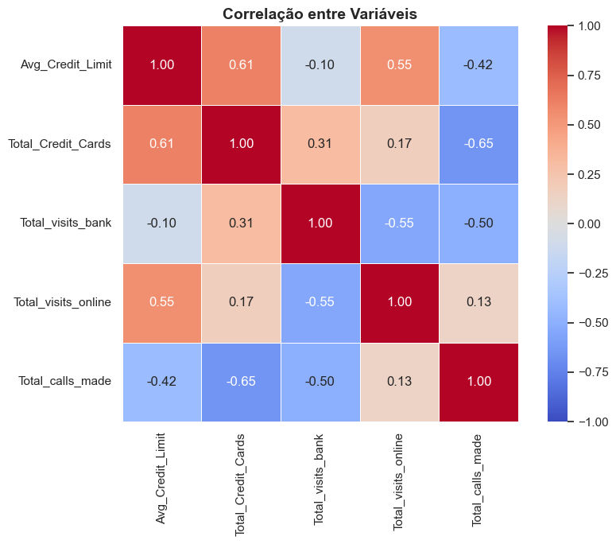
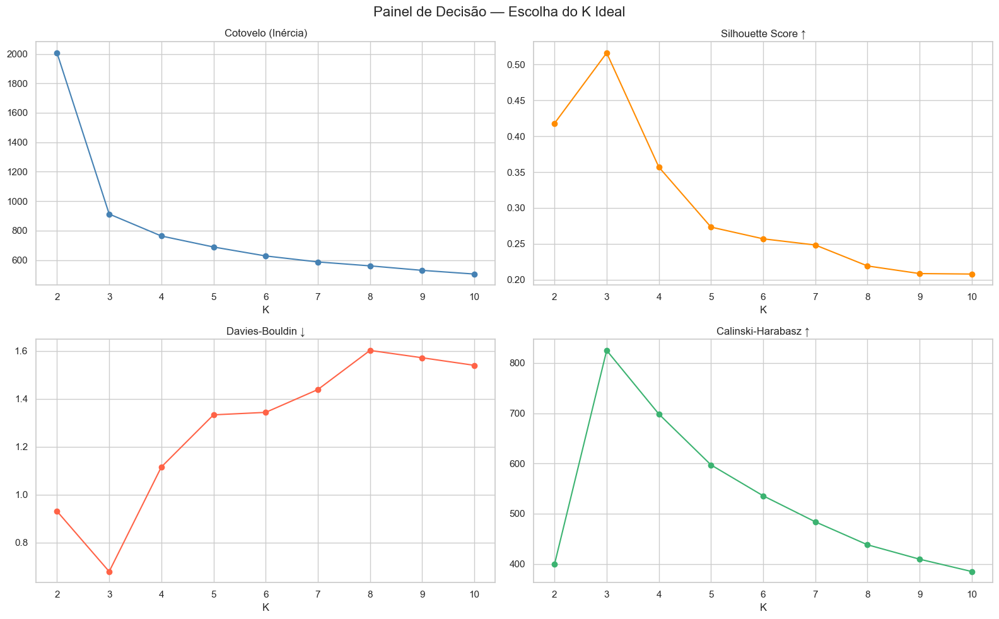
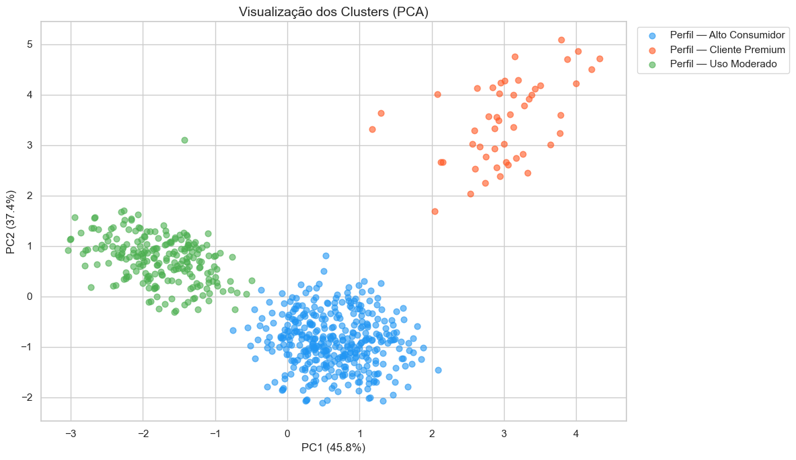
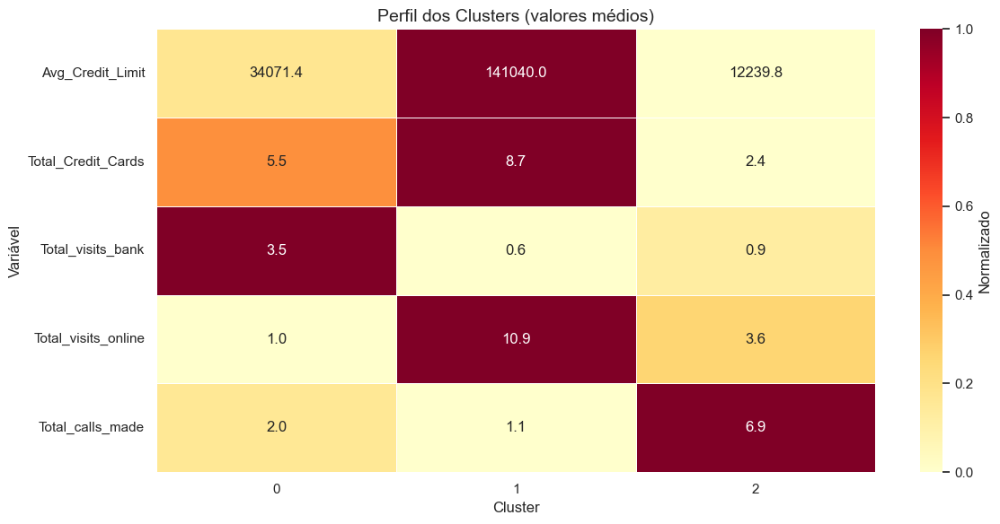

# Segmentação de Clientes com K-Means

Código desenvolvido para pré-processamento, análise exploratória, clusterização e validação estatística com a base de dados [Credit Card Customer Data](https://www.kaggle.com/datasets/aryashah2k/credit-card-customer-data) disponível no Kaggle.

O projeto visa explorar técnicas de **aprendizado não supervisionado**, com foco em segmentação de clientes bancários por comportamento de uso de crédito.

---

# Análise Geral

## Pré-processamento e Estatísticas Descritivas

A base contém 660 clientes e 7 colunas. Após remoção de duplicatas e colunas irrelevantes (`Sl_No`, `Customer Key`), restaram 649 registros e 5 variáveis numéricas para análise.

- **Limite de crédito:** média de R$ 34,8k, mas metade dos clientes tem até R$ 18k — evidência de assimetria e desigualdade na base
- **Cartões:** média de 4,7 cartões por cliente
- **Canais de atendimento:** uso médio de banco físico (2,4), online (2,6) e telefone (3,6)
- Apenas `Avg_Credit_Limit` e `Total_visits_online` apresentam outliers (~6%), interpretados como clientes especiais, não removidos

## Correlações

- Quem tem maior limite tende a ter mais cartões (+0.61)
- Quem usa canal online **não** frequenta o banco físico (−0.55)
- Quem tem mais cartões **não** realiza ligações (−0.65)
- O padrão sugere três perfis distintos de comportamento: digital, presencial e com suporte

## Escolha do Número de Clusters

Quatro métodos foram aplicados para determinar o K ideal:

| Método | K indicado |
|---|---|
| Cotovelo (Inércia) | 3 |
| Silhouette Score | 3 |
| Davies-Bouldin | 3 |
| Calinski-Harabasz | 3 |

**K = 3 foi escolhido** por unanimidade entre os métodos.

## Perfis Identificados

| Perfil | Clientes | Limite Médio | Cartões | Banco | Online | Ligações |
|---|---|---|---|---|---|---|
| Alto Consumidor | 378 (58,2%) | R$ 34.071 | 5,5 | 3,5 | 1,0 | 2,0 |
| Uso Moderado | 221 (34,1%) | R$ 12.240 | 2,4 | 0,9 | 3,6 | 6,9 |
| Cliente Premium | 50 (7,7%) | R$ 141.040 | 8,7 | 0,6 | 10,9 | 1,1 |

**Alto Consumidor:** perfil majoritário, prefere atendimento presencial, limite e cartões moderados.

**Uso Moderado:** menor limite e menos cartões; canal preferido é online e telefone — pode indicar clientes com menos acesso ou em fase inicial.

**Cliente Premium:** menor grupo, com o maior limite e uso quase exclusivo do canal digital. Alto engajamento online, pouco contato com banco físico ou suporte.

## Validação Estatística

O teste **Kruskal-Wallis** foi aplicado para verificar se as diferenças entre os clusters são estatisticamente significativas.

- H₀: os clusters têm a mesma distribuição
- H₁: pelo menos um cluster difere
- α = 0.05

| Variável | H | p-valor | Significativo |
|---|---|---|---|
| Avg_Credit_Limit | 259.08 | 0.0000 | ✓ |
| Total_Credit_Cards | 455.01 | 0.0000 | ✓ |
| Total_visits_bank | 429.51 | 0.0000 | ✓ |
| Total_visits_online | 444.82 | 0.0000 | ✓ |
| Total_calls_made | 422.24 | 0.0000 | ✓ |

**5 de 5 variáveis são significativas** — os clusters são estatisticamente diferentes entre si.

---

# Observações

- Os outliers de limite de crédito e visitas online (~6%) foram mantidos por representarem clientes legítimos com comportamento extremo.
- A normalização com `StandardScaler` foi aplicada antes da clusterização para evitar dominância de escala.
- A visualização PCA 2D captura a separação dos grupos mesmo com redução dimensional.

---

# Ferramentas utilizadas

| Python | Pandas | NumPy | Scikit-learn | Seaborn | Matplotlib | Git |
| ------ | ------ | ----- | ------------ | ------- | ---------- | --- |
|  |  |  |  |  |  |  |

---

# Como rodar

> Clique [aqui](https://github.com/JhenyfferOliveira/clustering) e visualize a análise completa realizada.
